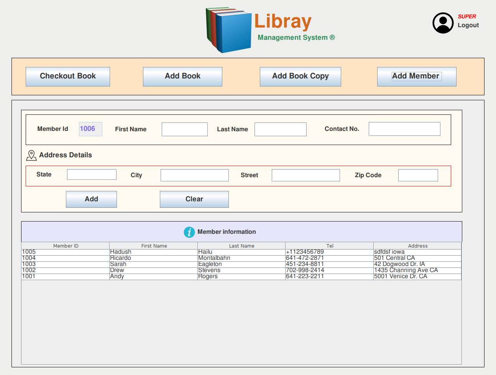

# Library Management System

#### This project utilized Java swing for UI design and File system as a storage mechanism using object serialization

#### Project structure
 - Please run the java class under "src/Library_Management_System/librarysystem/MainWindow.java" as an entry point to the project.
 - The following are the credential for the users
 - BOTH: usernmae: hadush password: hadush
 - LIBRARIAN: username: luwam password: luwam
 - ADMIN: username: sanju password: sanju

 
